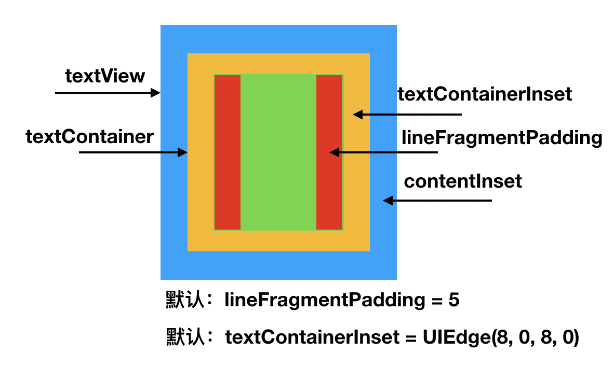

# BMTextView
### 主要解决问题：  
显示html富文本，包括显示图片和超链接。图片根据屏幕做适配，保证可以显示完全；超链接可以点击；没有长按效果；没有全选功能；没有复制粘贴；不能编辑。

### 方案一：  
直接使用WKWwebView显示html，简单粗暴。确实，省事不少，可以完美显示所有内容。但是，WKWwebView可以全选，能复制粘贴，图片在适配手机屏幕时，整体字体会变小。这都不是重点，重点是满足不了需求，我们需要显示两段独立的html字符串，而且它们中间还要客服端加一条分割线，嗯嗯，香菇蓝瘦。  
### 方案二：  
方案一pass掉了，现在来讲方案二。直接把html字符串转换成富文本，使用label显示。嗯嗯，这也是可以显示的。但是，图片如果尺寸很大的话，会显示不全，这也不是很致命，可以通过便利富文本，然后修改图片的尺寸就可以了，重点是，超链接点击。能想到的是，使用CoreText计算布局，然后再用range来锁定可以点击的rect。理乱上可以的，但是做起来还是很多问题，又麻烦。不知道是不是因为有图片的关系，CTLine的起点算的不准，有可能忽略的什么，所以，pass掉。（使用YYLabel和TTTAttributedLabel都显示不出来图片。）  
### 方案三：  
使用textView，图片显示不全和超链接的问题都能解决，复制粘贴功能也可以屏蔽掉，但是全选屏蔽掉了还是会偶尔点出来，并且，图片会有点击效果，长按还可以移动，这就有点坑了。所以，最终的方案还是使用textView，把编辑和选择禁掉，超链接就需要自己计算点击范围了，需要用到 **firstRectForRange:** 方法，省事不少的方法。

### Code
```
//textView1
_textView1 = [UITextView new];
_textView1.frame = rect;
_textView1.editable = NO;
_textView1.selectable = YES;
_textView1.dataDetectorTypes = UIDataDetectorTypeLink;
_textView1.delegate = self;
_textView1.attributedText = [self adjustAttachment: self.attributedStr width: _width];


//textView2
_textView2 = [UITextView new];
_textView2.frame = rect;
_textView2.attributedText = [self.attributedStr mutableCopy];
[_textView2 resetDefaultConfig];
__weak typeof(self) weakSelf = self;
_textView2.tapLinkBlock = ^(NSString * _Nonnull str) {
	__strong typeof(weakSelf) strongSelf = weakSelf;
	[strongSelf jumpToWebWithUrl: [NSURL URLWithString: str]];
};
[_textView2 adjustWebText];
```

### 注意：
1.系统版本等于或者低于 **iOS9.x** 调用 **firstRectForRange:** 方法返回的 **rect** 不准确，应该调用NSLayoutManager的 **boundingRectForGlyphRange:** 方法获取对应的rect，调用前要确保布局已生效，可以在调用该方法之前调用 **ensureLayoutForTextContainer:** 确保布局生效。  
2.先看textView的布局图：  
  
layoutManager返回的rect，是指在绿色方块的布局，所以，其正真的 **rect=(rect.origin.x+textContainer.left, rect.origin.y+textContainer.top, rect.size.width, rect.size.height)** ，其中，lineFragmentPadding系统会自动的加上，不需要手动添加。其中可以显示内容的区域为绿色-红色的区域。